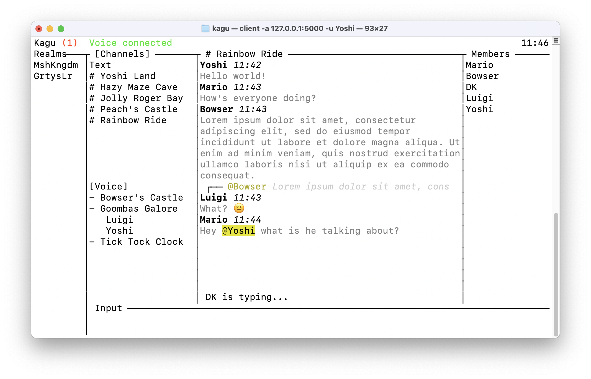

<h1 align="center"></h1>

# Kagu

Kagu aims to be a fast, private, self-hosted and lightweight alternative to a familiar chat service.

Kagu is powered by:
- 🚀 [rust] for stability, speed and security
- 🔊 [cpal] for audio playback and recording
- 👟 [swiftlet] to leverage the speed and reliability of QUIC
- 🖼️ [ratatui] for a rich terminal user interface

<h1 align="center"></h1>

## Getting Started

Follow these instructions.

### Prerequisites

* To build the client on Debian or Ubuntu, install `libasound2-devel`.
* To build the client on Fedora install `alsa-lib-devel`.
* Note: Running the server does not require installing additional dependencies.

### Clone the repo

```
git clone https://github.com/bblsh/kagu.git
```

### Running Kagu

To run the client, run:

```
cargo run --bin client -- -u username -a address -c cert_dir
```

This will establish a connection with the server  at `ip:port` and display a TUI. Messages sent will be sent as `username`.
The connection will be encrypted using the cert provided in `cert_dir` (must be a full path).

To run the server, run:

```
cargo run --bin kagu-server -- -p port -c cert_dir
```

The server will listen for QUIC connections on port `port` and encrypt the connection using the certificate provided in `cert_dir` (must be a full path). The provided certificates should not be used in production.

The `--ipv6` argument may be provided to serve over IPv6.

## Navigating the Client Interface
To navigate through different panes (Messages, Channels, Input), use arrow keys.

To enter a text or voice channel, navigate to the Channels panel and press `Enter`.
- `Down` or `Up` will switch between text and voice channel sections.
- Press `Enter` to enter specific text or voice channels.
- While voice chat is live, press `Ctrl+D` to disconnect from a voice channel.
- `Esc` or `q` will exit selection and navigation of text or voice channels and place you in navigation mode.

To begin typing a message, press `i` and you will enter edit mode.

To send a message, press `Enter` while in edit mode.

To mention a user, type `@` and select a user by pressing `Tab` to autocomplete or `Enter` to send the message with that user mentioned.

Pressing `Esc` will exit edit mode.

`Ctrl+C` will disconnect the client and exit the program at any time.

`q` will disconnect and exit the program when not in edit mode.

### Realms and Channels
Realms and Channels can be added or removed.

To add a realm, navigate to the Realms pane, press `Enter`, then `Ctrl+a` to make a new realm. The input box to enter a realm code does nothing at the moment.

To remove a realm, navigate to the Realms pane, press `Enter`, then `Ctrl+r` when the realm to remove is highlighted. When prompted, press `Enter` to begin typing, and `Enter` again to confirm and remove.

Similarly, text and voice channels can be added by navigating to the Channels pane, pressing `Enter`, and `Ctrl+a` to add a channel. `Ctrl+r` will remove the channel.

`Esc` will exit focus from an input box, and pressing `q` will back out of a menu to add or remove a realm or channel.

## Planned Features
* Ability to generate certificates for the server
* Persistent messages using a database
* Scrolling in text input
* Ability to choose an audio input and output
* Group messages and calls
* User roles
* User permissions

## Notes / Known Issues
* If using voice comms on macOS, verify your input format is `48,000 Hz` in the Audio MIDI Setup program.
* All audio inputs and outputs may not be shown.
* Some features that are drawn out of bounds due to too small of a terminal size will panic the client.
* Kagu was used as motivation to learn Rust, so it is currently *very* unoptimized.
* Audio is currently echoed back to the user speaking.
* Any and all feedback or pull requests to improve Kagu in any way is welcome!
* This was tested on macOS, and `cpal` may have issues building or running on other platforms.
* Windows has not been fully tested yet.

[rust]: https://www.rust-lang.org/
[cpal]: https://github.com/RustAudio/cpal
[swiftlet]: https://github.com/MediaEnhanced/Swiftlet
[ratatui]: https://github.com/tui-rs-revival/ratatui